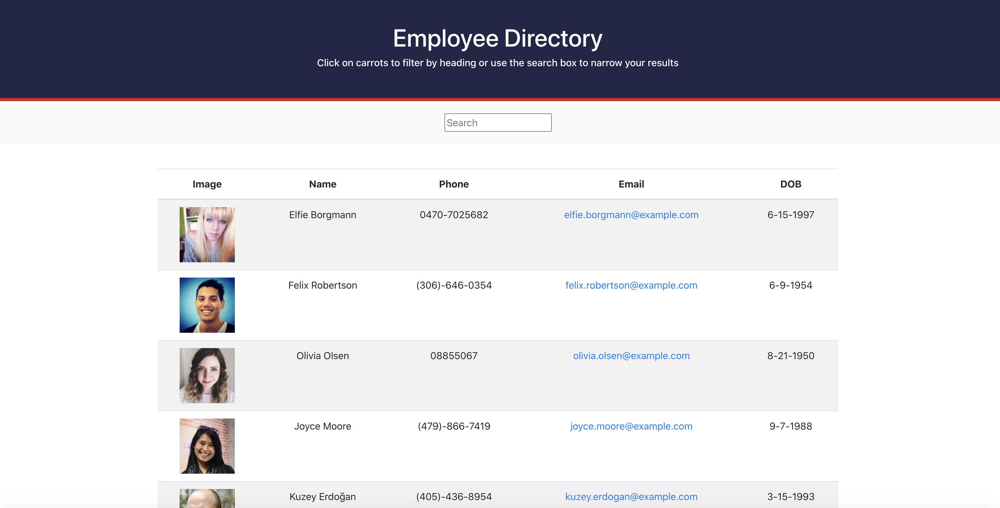
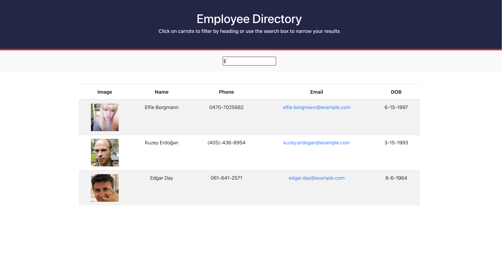

# Employee Directory

## Table of Contents

* [Description](#description)
* [Installation](#installation)
* [Usage](#usage)
* [Contributing](#contributing)
* [Tests](#tests)
* [Questions](#questions)
* [License](#license)

## Description
An application that provides an employee or manager with a table of non-sensitive data about other employees.

## Installation
run 'npm i' in the command line

## Usage
run 'npm start' in the command line

## Contributing
If you'd like to contribute to this project, start by forking the repository to your personal GitHub account. From there, make your changes and then open a Pull Request in this repository against the branch in your fork.

## Tests
Currently, there are no tests in the project. If you're interested in contributing to the project, this is something that would be a great contribution.

## Link

[Github pages link](https://cfox2019.github.io/Employee-Directory/)

## Questions
GitHub: [CFox2019](https://github.com/CFox2019)

Email me at [courtney.fox@me.com](courtney.fox@me.com) with additional questions.

## License
This project is covered under the MIT license.
